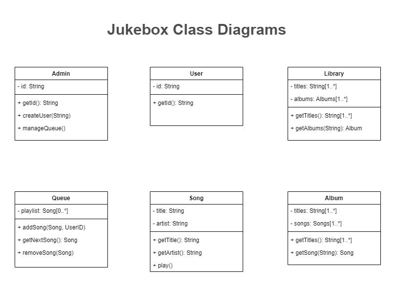

# Spaceship Jukebox

-----
This project look for setting a practice on how the Object-Oriented Analysis and Design process
works. Here we go from each stage, from the customer requirements to the coding phase in the programming
language we choose.

The astronauts need some music for their long journey to the moon. So we need your help to design a
jukebox for our moon shuttle. As astronauts don't carry money with them, this jukebox will
be free to use. But we don't want to let just one person pick all the music and drive the others crazy.

The jukebox should let a user select an album from the available music library, and then choose
individual songs from that album to be played. And as an extra precaution, if one astronaut adds more
than three songs in a row to the play queue, and another astronaut wants to play a song, they'll jump
ahead in line.

First, write a set of requirements to design the jukebox. Try to come up with at least three functional
and three non-functional requirements. Use the attributes of FURPS+ to inspire possible requirements.

## Requirements
**Functional Requirements:**
- The system must maintain a music library of albums and songs. 
- The system must allow users to browse those albums and songs
- The system must allow users to select individual songs, and preventing them from playing full albums. 
- The system must maintain a queue of songs to play.
- The jukebox needs to actually play music. 
- The system must allow the user to sort by artists.
- The jukebox should identify individual users.
- The system must track the number of plays per user.

**Non-Functional Requirements**

*Usability:*
- The system should be intuitive to use while the astronauts are floating around in space.

*Reliability:* 
- The jukebox need to be available for them all day, every day, 24/7.

*Performance:*
- The system to be low-power.

*Supportability:* 
- The jukebox should have an updatable music library. 

## Use Case and User Stories

### Use cases scenario for selecting a song to play

---
**Title:** Play a Song

**Primary Actor:** User

**Success Scenario:** The *system* <u>identifies the *user*</u>. The user <u>browses the *library*</u> 
of available *albums*. The user <u>selects an album</u> and <u>browse the *list* of *songs*</u> on the 
selected album. Finally, the user <u>selects a song</u>. The system <u>plays selected song</u>.

### Use cases scenario for selecting multiple songs to play

---
**Title:** Select Multiple Songs

**Primary Actor:** User

**Success Scenario:**
1. *System* <u>identifies the *user*</u>. 
2. User <u>browses the *library*</u>of available *albums*. 
3. User <u>selects an album</u> and <u>browse the *list* of *songs*</u> on the selected album.
4. User <u>selects a song</u>. 
5. System begins <u>playing selected song</u>.
6. User <u>continues browsing</u> and <u>selects a second song</u>.
7. System <u>adds that second song to a play *queue*</u>.
8. System <u>plays the second song</u> after the first song is over.

### User stories

---
- As a *user*, I want my *song* to be added to the front of the long play *queue*, so that I don't 
have to wait hours to hear it.
- As a user, I want to be identified without having to touch anything, so that I can use my hands to 
do other things.
- As a user, I want to sort and browse songs by *artist*, so that I can listen to every song of my
favorite artists.
- As the spaceship's *commander*, I want the *ability* to <u>cancel other users *selections*</u>, so 
that I don't have to listen to other user selection if I don't want.

## Domain Modeling
**Class**

Here we list all nouns from the Use Cases and User Stories to determine the possible objects:

~~System~~ - User - Library - Album - ~~List~~ - Song - Queue - ~~Commander~~ => Admin - ~~Ability~~ - 
~~Selection~~ 

1. We discard the noun system because we do not want to have a god object in our program.
2. We can omit the word list which is previously represented by list of song in album.
3. We also remove Selection from the list because its meaning was previously captured by the song in 
queue.
4. We need to remove the noun ability because it refers more to a behavior than as an object.
5. It would be better if change the term Commander to Admin to describe better the role.

**Responsibilities**

Now, we are going look for the responsibilities of those objects. For that purpose we need to pick verbs
phrases on the Use Cases and User Stories:

* Identifies the user 
* Browses the library 
* Selects an album 
* Browse the list of songs 
* Selects a song 
* Plays selected song 
* ~~Continues browsing~~ 
* ~~Selects a second song~~ 
* Adds that second song to a play queue 
* Plays the second song
* Cancel other users selections

1. Here we discard the verb phrase *"Continues browsing"* as it is repeating a behaviour that was 
captured in a previous verb phrase *"Browse library"*.
2. Same for the phrase *"Select a second song"* which is te same behaviour as *"Selects a song"*.

### Jukebox Conceptual Model
Following is the Conceptual Model Diagram which lists all the objects and their relationships.

## Class Diagrams
Next is the Class Diagram based on the objects and responsibilities identified in the Conceptual Model.

## Class Relationships

